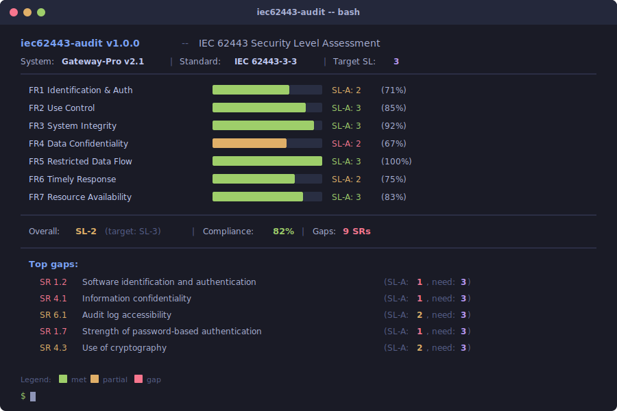
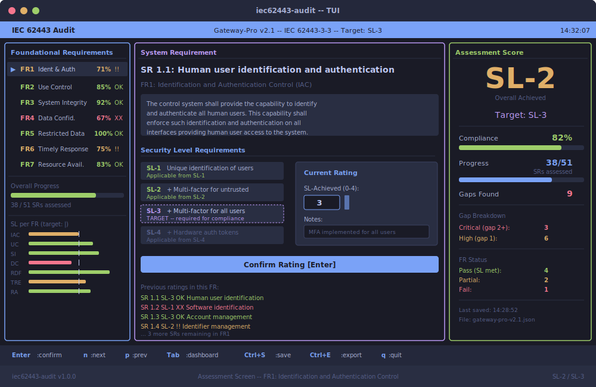

# iec62443-audit v1.0.0

[](https://github.com/isecwire/iec62443-audit/actions/workflows/ci.yml)
[](LICENSE)
[](https://www.python.org/)

Professional IEC 62443 security level assessment tool for industrial control systems.
Stable production release.

Comprehensive assessment of ICS/SCADA systems against IEC 62443-3-3 (system) and
IEC 62443-4-2 (component) standards, with cross-standard compliance mapping,
gap analysis, action plan generation, multi-zone support, and an optional
interactive TUI.

## What is IEC 62443?

IEC 62443 is the international standard series for industrial automation and
control system (IACS) security. This tool covers:

- **IEC 62443-3-3**: System security requirements and security levels (51 SRs)
- **IEC 62443-4-2**: Component-level security requirements (60+ CRs)

Both organized around seven Foundational Requirements (FRs):

| FR | Name | Abbreviation |
|----|------|--------------|
| FR1 | Identification and Authentication Control | IAC |
| FR2 | Use Control | UC |
| FR3 | System Integrity | SI |
| FR4 | Data Confidentiality | DC |
| FR5 | Restricted Data Flow | RDF |
| FR6 | Timely Response to Events | TRE |
| FR7 | Resource Availability | RA |

### Security Levels (SL)

- **SL 1** -- Protection against casual or coincidental violation
- **SL 2** -- Protection against intentional violation using simple means
- **SL 3** -- Protection against intentional violation using sophisticated means
- **SL 4** -- Protection against intentional violation using sophisticated means with extended resources

## Features

- Interactive CLI assessment with Rich-formatted output
- IEC 62443-3-3 (system) and IEC 62443-4-2 (component) standards
- Cross-standard mapping: NIST CSF, ISO 27001, CIS Controls v8
- Regulatory mapping: EU CRA, NIS2 Directive, GDPR
- Spider/radar charts and gap heatmaps (ASCII)
- Remediation action plans with effort estimates and timelines
- Multi-zone/conduit assessments with site-level aggregation
- Evidence collection and maturity tracking
- Risk-based weighted compliance scoring
- Export: JSON, HTML, CSV, Markdown
- Import from CSV for batch assessments
- Optional Textual TUI for full interactive experience

## Screenshots

### CLI Mode



### Interactive TUI



## Installation

```bash
pip install -e .
```

With optional TUI support:

```bash
pip install -e ".[tui]"
```

## Usage

### Run an Interactive Assessment

```bash
# IEC 62443-3-3 system assessment (default)
iec62443-audit assess --target 2 --output my-plant

# IEC 62443-4-2 component assessment
iec62443-audit assess --standard iec62443-4-2 --target 3 --output plc-assessment

# With action plan generation
iec62443-audit assess --target 2 --output my-plant --action-plan

# Export as CSV
iec62443-audit assess --target 2 --output my-plant --format csv
```

### Launch the TUI (Interactive Terminal UI)

```bash
# Full interactive TUI
iec62443-audit --tui

# Load existing assessment in TUI
iec62443-audit --tui assess --load assessment.json
```

The TUI provides:
- Welcome screen with project setup
- FR sidebar with color-coded completion status
- SR assessment with description, SL levels, evidence input
- Dashboard with spider chart, compliance bars, gap summary
- Action plan view with sortable priorities
- Keyboard navigation: Tab, Enter, n/p, Ctrl+S, Ctrl+E, q

### Generate Reports

```bash
# Console summary with all visualizations
iec62443-audit report assessment.json --gaps --spider --heatmap

# Cross-standard compliance mapping
iec62443-audit report assessment.json --mapping

# Generate action plan
iec62443-audit report assessment.json --action-plan

# Export to different formats
iec62443-audit report assessment.json --format csv
iec62443-audit report assessment.json --format markdown
iec62443-audit report assessment.json --html report.html
```

### Compare Assessments

```bash
iec62443-audit compare baseline.json current.json
```

### Export Compliance Matrix

```bash
# Full IEC 62443 -> NIST/ISO/CIS/CRA/NIS2 mapping
iec62443-audit matrix

# Map from a specific assessment
iec62443-audit matrix --input assessment.json
```

### Import from CSV

```bash
# Batch import (CSV must have SR_ID, SL_Achieved columns)
iec62443-audit import ratings.csv --target 2 --name "Plant Alpha"
```

## Example Output

```
Foundational Requirements -- Water Treatment Plant Zone A

  FR  Name                                   Status         SL-T  Compliance                   Gaps
  FR1 Identification and Authentication (IAC) SL-1 [XX]      2   =========...........  69%       4
  FR2 Use Control (UC)                        SL-1 [XX]      2   ========............  58%       5
  FR3 System Integrity (SI)                   SL-1 [XX]      2   =========...........  67%       3
  FR4 Data Confidentiality (DC)               SL-0 [XX]      2   =====...............  33%       2
  FR5 Restricted Data Flow (RDF)              SL-1 [XX]      2   =======.............  50%       2
  FR6 Timely Response to Events (TRE)         SL-1 [!!]      2   =======.............  50%       1
  FR7 Resource Availability (RA)              SL-1 [XX]      2   ===========.........  75%       2

Gap Analysis Heatmap
  Each cell = one SR. Color intensity = gap severity.

   IAC ???????????? ?  69% (4 gaps)
    UC ???????? ???? ?  58% (5 gaps)
    SI ????????? ??  67% (3 gaps)
    DC ???  33% (2 gaps)
   RDF ???? ?  50% (2 gaps)
   TRE ?? ?  50% (1 gaps)
    RA ?????????????? ??  75% (2 gaps)
```

## Cross-Standard Mapping

The tool maps each IEC 62443 SR to:

| Standard | Example Mappings |
|----------|-----------------|
| NIST CSF | PR.AC-1, DE.CM-4, RC.RP-1, etc. |
| ISO 27001:2022 | A.9.2.1, A.12.4.1, A.14.1.2, etc. |
| CIS Controls v8 | CIS 5.1, CIS 8.2, CIS 12.2, etc. |
| EU CRA | Annex I Part I requirements |
| NIS2 | Art. 21(2) measures |
| GDPR | Art. 32 security, Art. 5 accountability |

## Project Structure

```
iec62443_audit/
  __init__.py              Version metadata
  __main__.py              Entry point for python -m
  cli.py                   Argparse CLI with full subcommand suite
  requirements.py          IEC 62443-3-3 FR and SR data definitions
  assessor.py              Interactive assessment engine (Rich)
  scoring.py               SL calculation, gap analysis, weighted scoring
  report.py                Console, JSON, and HTML report generation
  display.py               Rich CLI output: tables, charts, heatmaps
  action_plan.py           Remediation action plan generator
  zones.py                 Multi-zone/conduit assessment
  evidence.py              Evidence collection and tracking
  maturity.py              Implementation maturity model
  standards/
    __init__.py
    iec62443_4_2.py        IEC 62443-4-2 component requirements
    mapping.py             Cross-standard mapping (NIST, ISO, CIS, CRA, NIS2)
  tui/
    __init__.py            TUI launcher and dependency check
    app.py                 Main Textual App class
    screens.py             Assessment, dashboard, action plan screens
    widgets.py             Custom widgets (spider chart, progress bars, etc.)
  templates/
    report.html            Jinja2 HTML report template
tests/
  test_requirements.py     FR/SR data validation tests
  test_scoring.py          Scoring, gap analysis, comparison tests
  test_report.py           JSON/HTML export tests
```

## FAQ

### What is IEC 62443?

**IEC 62443** is the international cybersecurity standard for industrial automation and control systems. It defines **how to secure** a factory, power plant, water treatment facility, or any industrial operation.

### Who requires it and why?

- **Power plant operators, water utilities, factories** — they will **not buy** equipment without IEC 62443 certification
- **Insurance companies** — lower premiums for IEC 62443 compliant operations
- **EU regulators** — increasingly required by law under NIS2 Directive
- **Enterprise procurement** — large companies require it in RFPs (Request for Proposal)

### What are NIST CSF and ISO 27001?

**NIST CSF** (Cybersecurity Framework) = US government's cybersecurity guidelines. **ISO 27001** = international standard for information security management. They overlap with IEC 62443 — different clients ask for different standards, but the requirements are similar. Our tool maps IEC 62443 requirements to both NIST and ISO 27001, so one assessment covers multiple compliance needs.

### How to use it?

```bash
iec62443-audit assess --standard iec62443-3-3 --target-sl 3   # interactive assessment
iec62443-audit report --input assessment.json --format html     # generate PDF-ready report
iec62443-audit compare old.json new.json                        # track progress over time
```

## License

MIT -- Copyright (c) 2026 isecwire GmbH
